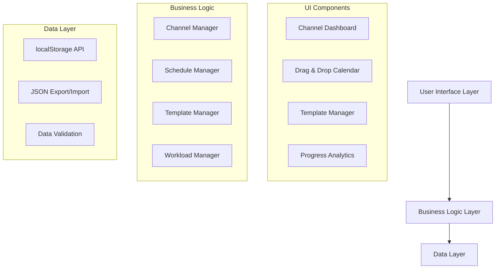

# Design Document

## Overview

The Multi-Channel Content Management System is a client-side web application built with modern JavaScript frameworks to provide an intuitive drag-and-drop interface for managing multiple YouTube channels. The system uses a component-based architecture with localStorage for data persistence, ensuring offline functionality and user data privacy.

The application consists of four main views: Channel Portfolio Dashboard, Content Planning & Templates, Weekly Calendar Scheduler, and Analytics & Progress Tracking. All data operations are performed client-side with JSON export/import capabilities for backup and portability.

## Architecture

### High-Level Architecture



### Technology Stack

- **Frontend Framework**: React with TypeScript for type safety and component reusability
- **Drag & Drop**: React DnD library for smooth drag-and-drop interactions
- **Calendar Component**: Custom weekly calendar grid with time slot management
- **State Management**: React Context API with useReducer for complex state operations
- **Styling**: CSS Modules with Flexbox/Grid for responsive layout
- **Data Persistence**: Browser localStorage with JSON serialization
- **Build Tool**: Vite for fast development and optimized production builds

## Components and Interfaces

### Core Data Models

```typescript
interface Channel {
  id: string;
  name: string;
  contentType: 'gaming' | 'educational' | 'entertainment' | 'lifestyle' | 'other';
  postingSchedule: {
    frequency: 'daily' | 'weekly' | 'biweekly' | 'monthly';
    preferredDays: string[];
    preferredTimes: string[];
  };
  color: string; // For visual identification
  createdAt: Date;
  isActive: boolean;
}

interface ContentTemplate {
  id: string;
  name: string;
  contentType: 'video' | 'short' | 'post';
  estimatedHours: {
    planning: number;
    production: number;
    editing: number;
    publishing: number;
  };
  workflowSteps: string[];
  channelIds: string[]; // Associated channels
}

interface Task {
  id: string;
  channelId: string;
  templateId?: string;
  title: string;
  contentType: 'video' | 'short' | 'post';
  estimatedHours: number;
  status: 'planned' | 'in-progress' | 'completed' | 'overdue';
  scheduledStart: Date;
  scheduledEnd: Date;
  actualHours?: number;
  notes?: string;
}

interface WeeklySchedule {
  weekStartDate: Date;
  tasks: Task[];
  totalScheduledHours: number;
  userCapacityHours: number;
  isOverloaded: boolean;
}
```

### Component Architecture

#### 1. Channel Portfolio Dashboard
- **ChannelGrid**: Displays all channels in a responsive grid layout
- **ChannelCard**: Individual channel display with quick stats and actions
- **AddChannelModal**: Form for creating new channels
- **ChannelSettings**: Edit existing channel properties

#### 2. Content Planning & Templates
- **TemplateLibrary**: Grid view of all available templates
- **TemplateEditor**: Form for creating/editing content templates
- **ContentTypeSelector**: Radio buttons for video/short/post selection
- **TimeEstimator**: Input fields for different production phases

#### 3. Weekly Calendar Scheduler
- **CalendarGrid**: 7-day weekly view with hourly time slots
- **DraggableTask**: Individual task components that can be moved
- **TimeSlot**: Drop zones for task placement
- **ScheduleControls**: Week navigation and view options
- **ConflictIndicator**: Visual warnings for scheduling conflicts

#### 4. Analytics & Progress Tracking
- **ChannelProgressBar**: Visual completion rates per channel
- **WorkloadChart**: Weekly capacity vs scheduled hours visualization
- **StatusIndicators**: Color-coded channel health indicators
- **CompletionStats**: Numerical progress summaries

### State Management Structure

```typescript
interface AppState {
  channels: Channel[];
  templates: ContentTemplate[];
  currentWeek: WeeklySchedule;
  selectedChannelId?: string;
  userSettings: {
    weeklyCapacityHours: number;
    workingDays: string[];
    workingHours: { start: string; end: string };
  };
  ui: {
    activeView: 'dashboard' | 'templates' | 'calendar' | 'analytics';
    isLoading: boolean;
    errors: string[];
  };
}
```

## Data Models

### localStorage Schema

Data is stored in localStorage using the following key structure:

- `mcm_channels`: Array of Channel objects
- `mcm_templates`: Array of ContentTemplate objects  
- `mcm_schedules`: Object with week dates as keys, WeeklySchedule as values
- `mcm_user_settings`: User preferences and capacity settings
- `mcm_app_version`: Version number for data migration compatibility

### Data Validation

All data operations include validation layers:

1. **Schema Validation**: TypeScript interfaces enforce structure
2. **Business Rule Validation**: Custom validators for scheduling conflicts
3. **Data Integrity Checks**: Referential integrity between channels, templates, and tasks
4. **Import Validation**: JSON structure verification before applying imported data

## Error Handling

### Client-Side Error Categories

1. **Data Persistence Errors**
   - localStorage quota exceeded
   - localStorage unavailable (private browsing)
   - Data corruption detection and recovery

2. **User Input Errors**
   - Invalid time slot selections
   - Scheduling conflicts
   - Template validation failures

3. **Import/Export Errors**
   - Invalid JSON format
   - Version compatibility issues
   - Missing required fields

### Error Recovery Strategies

- **Graceful Degradation**: Core functionality remains available even with localStorage issues
- **Data Backup**: Automatic local backup before major operations
- **User Notifications**: Clear, actionable error messages with recovery suggestions
- **Rollback Capability**: Undo functionality for critical operations

## Testing Strategy

### Unit Testing
- **Component Testing**: React Testing Library for UI component behavior
- **Business Logic Testing**: Jest for data manipulation and validation functions
- **localStorage Testing**: Mock localStorage for data persistence scenarios

### Integration Testing
- **Drag & Drop Workflows**: End-to-end testing of task scheduling flows
- **Data Import/Export**: Full cycle testing of backup and restore functionality
- **Cross-Browser Compatibility**: Testing localStorage behavior across browsers

### User Acceptance Testing
- **Workflow Validation**: Testing complete user journeys from channel creation to task completion
- **Performance Testing**: Large dataset handling (100+ channels, 1000+ tasks)
- **Accessibility Testing**: Keyboard navigation and screen reader compatibility

### Test Data Management
- **Mock Data Generators**: Realistic test datasets for different user scenarios
- **Edge Case Testing**: Boundary conditions for scheduling and capacity limits
- **Data Migration Testing**: Version upgrade scenarios with existing user data

## Performance Considerations

### Optimization Strategies
- **Virtual Scrolling**: For large task lists and calendar views
- **Lazy Loading**: Template and analytics data loaded on demand
- **Debounced Updates**: Batch localStorage writes to prevent excessive I/O
- **Memoization**: React.memo and useMemo for expensive calculations

### Memory Management
- **Data Cleanup**: Automatic removal of old schedule data beyond retention period
- **Component Cleanup**: Proper cleanup of event listeners and timers
- **localStorage Monitoring**: Proactive warnings when approaching storage limits