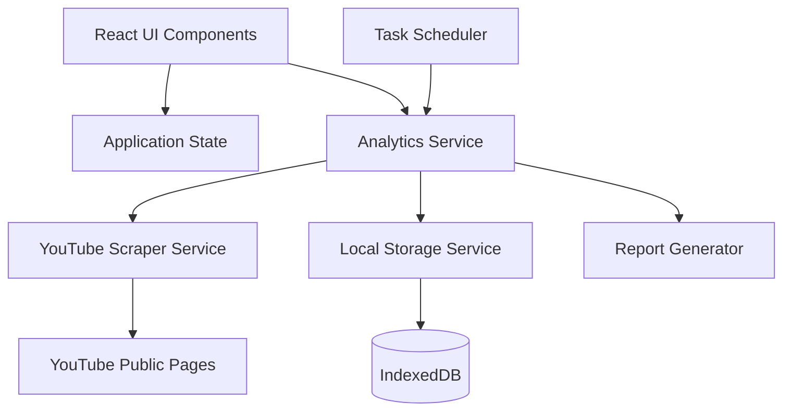

# Design Document

## Overview

The YouTube Public Data Analytics & Reporting System will be integrated into the existing Multi-Channel Content Manager as a new analytics module. The system will use web scraping to collect public YouTube channel data, store it locally, and provide automated reporting capabilities. The design leverages the existing React/TypeScript architecture and adds new services for data collection, storage, and analysis.

## Architecture

### High-Level Architecture



### Component Integration

The system will integrate with the existing application by:
- Adding a new "Public Analytics" section to the existing analytics view
- Extending the current state management system with analytics data
- Utilizing the existing notification system for alerts and reports
- Leveraging the current React component architecture

## Components and Interfaces

### Core Services

#### YouTubeScraperService
```typescript
interface YouTubeScraperService {
  scrapeChannelData(channelUrl: string): Promise<ChannelData>;
  validateChannelUrl(url: string): boolean;
  extractChannelId(url: string): string;
  handleRateLimit(): Promise<void>;
}

interface ChannelData {
  channelId: string;
  channelName: string;
  subscriberCount: number | null;
  totalViews: number;
  videoCount: number;
  creationDate: Date;
  isSubscriberCountPublic: boolean;
  scrapedAt: Date;
}
```

#### AnalyticsStorageService
```typescript
interface AnalyticsStorageService {
  saveChannelData(data: ChannelData): Promise<void>;
  getChannelHistory(channelId: string, days?: number): Promise<ChannelData[]>;
  getAllTrackedChannels(): Promise<TrackedChannel[]>;
  addTrackedChannel(channel: TrackedChannel): Promise<void>;
  removeTrackedChannel(channelId: string): Promise<void>;
  updateChannelGoals(channelId: string, goals: ChannelGoals): Promise<void>;
}

interface TrackedChannel {
  channelId: string;
  channelUrl: string;
  channelName: string;
  addedAt: Date;
  isActive: boolean;
  goals?: ChannelGoals;
}

interface ChannelGoals {
  subscriberTarget?: number;
  viewTarget?: number;
  targetDate?: Date;
}
```

#### ReportGeneratorService
```typescript
interface ReportGeneratorService {
  generateWeeklyReport(channelIds: string[]): Promise<WeeklyReport>;
  calculateGrowthMetrics(current: ChannelData, previous: ChannelData): GrowthMetrics;
  exportToCSV(data: ChannelData[], filename: string): Promise<void>;
  generateTrendAnalysis(channelId: string, days: number): Promise<TrendAnalysis>;
}

interface WeeklyReport {
  reportDate: Date;
  channels: ChannelReport[];
  summary: ReportSummary;
}

interface ChannelReport {
  channelId: string;
  channelName: string;
  currentMetrics: ChannelData;
  growthMetrics: GrowthMetrics;
  goalProgress: GoalProgress;
  alerts: PerformanceAlert[];
}

interface GrowthMetrics {
  subscriberGrowth: number;
  subscriberGrowthPercent: number;
  viewGrowth: number;
  viewGrowthPercent: number;
  videoGrowth: number;
  weekOverWeekComparison: 'up' | 'down' | 'stable';
}
```

#### TaskSchedulerService
```typescript
interface TaskSchedulerService {
  scheduleWeeklyCollection(): void;
  scheduleReportGeneration(): void;
  executeDataCollection(): Promise<void>;
  pauseScheduler(): void;
  resumeScheduler(): void;
}
```

### React Components

#### PublicAnalyticsDashboard
Main container component that displays the analytics overview and manages the analytics state.

#### ChannelTracker
Component for adding, removing, and managing tracked channels with URL input validation.

#### AnalyticsCharts
Visualization component using Chart.js or similar library to display growth trends and comparisons.

#### WeeklyReportViewer
Component for displaying generated weekly reports with filtering and export capabilities.

#### GoalTracker
Component for setting and monitoring channel growth goals with progress indicators.

#### AlertCenter
Component for displaying performance alerts and notifications.

## Data Models

### Database Schema (IndexedDB)

```typescript
// Object Stores
interface ChannelDataStore {
  keyPath: 'id';
  indexes: ['channelId', 'scrapedAt'];
}

interface TrackedChannelStore {
  keyPath: 'channelId';
  indexes: ['addedAt', 'isActive'];
}

interface ReportStore {
  keyPath: 'id';
  indexes: ['reportDate', 'channelId'];
}

interface AlertStore {
  keyPath: 'id';
  indexes: ['channelId', 'createdAt', 'acknowledged'];
}
```

### State Management Integration

```typescript
// Extend existing AppState
interface AppState {
  // ... existing state
  analytics: AnalyticsState;
}

interface AnalyticsState {
  trackedChannels: TrackedChannel[];
  recentReports: WeeklyReport[];
  alerts: PerformanceAlert[];
  isCollecting: boolean;
  lastCollectionDate: Date | null;
  collectionErrors: CollectionError[];
}
```

## Error Handling

### Scraping Error Management
- **Rate Limiting**: Implement exponential backoff with jitter
- **Blocked Requests**: Rotate user agents and implement request delays
- **Invalid Channels**: Graceful handling with user notification
- **Network Failures**: Retry mechanism with circuit breaker pattern

### Data Validation
- **URL Validation**: Regex patterns for YouTube channel URLs
- **Data Sanitization**: Clean scraped data before storage
- **Schema Validation**: Ensure data integrity before database operations

### User Experience
- **Loading States**: Show progress during data collection
- **Error Messages**: Clear, actionable error descriptions
- **Fallback UI**: Graceful degradation when data is unavailable

## Testing Strategy

### Unit Tests
- Service layer methods (scraping, storage, reporting)
- Data transformation and validation functions
- Growth calculation algorithms
- URL parsing and validation

### Integration Tests
- End-to-end data collection workflow
- Database operations and data persistence
- Report generation with real data
- Scheduler execution and timing

### Component Tests
- React component rendering and interactions
- State management and data flow
- User input validation and error handling
- Chart rendering and data visualization

### Performance Tests
- Scraping performance under rate limits
- Database query performance with large datasets
- Memory usage during bulk data operations
- UI responsiveness during data loading

## Implementation Considerations

### Web Scraping Strategy
- **Puppeteer Integration**: Use headless browser for JavaScript-rendered content
- **Request Throttling**: Implement delays between requests (2-5 seconds)
- **User Agent Rotation**: Vary browser signatures to avoid detection
- **Proxy Support**: Optional proxy rotation for enhanced reliability

### Data Collection Scheduling
- **Web Workers**: Run collection in background to avoid UI blocking
- **Incremental Collection**: Stagger channel scraping to distribute load
- **Failure Recovery**: Resume collection from last successful channel

### Performance Optimization
- **Lazy Loading**: Load analytics data on-demand
- **Data Pagination**: Limit initial data loads for large datasets
- **Caching Strategy**: Cache frequently accessed reports and metrics
- **Background Processing**: Use service workers for report generation

### Security and Privacy
- **No Authentication**: System operates on public data only
- **Local Storage**: All data stored locally, no external transmission
- **Rate Limiting Compliance**: Respect YouTube's implicit rate limits
- **Error Logging**: Log errors without exposing sensitive information